为什么我们需要内网穿透？本质上是由于IPV4数量不够，我们无法申请到公网IPV4，由于外网无法通过IP来直接定位到我们家中的服务器，所以我们上述介绍了N种内网穿透方案去解决这一个问题。

内网穿透由于其技术特点，可能存在无法穿透成功，或是成功后速度很慢的情况，基本上难以跑满网络带宽。下面介绍的IPV6方案是可以解决速度上的问题。

由于ipv6 基本上是算是用之不竭的，所以现在很容易申请到IPV6地址。

<!--more-->
<!-- truncate -->

## 光猫开启IPV6 设置

虽然IPV6已经推广了很多年，很多网站也是号称接入了IPV6，但是从大部分场景实测下来。车站，咖啡馆，图书馆，居民家中的WIFI默认都是不支持IPV6的。

很大的一个原因是运营商目前是限制居民使用IPV6设备的，家中的光猫是默认关闭IPV6功能，所以第一步我们需要给光猫开启IPV6。

### 1. 获取超管账号密码

北京移动的超管账号密码是公开的

```
账号：CMCCAdmin
密码：aDm8H%MdA
```

但是很遗憾，直接使用上述密码并不能登录系统。需要联系装宽带的师傅，帮你申请开启超管账号。在开启超管账号后就可以用上述密码进行登录了。

### 2. 光猫设置

光猫需要将连接名称设置为 **2_INTERNET_R_VID_10**

经过实践发现，设置了没有反应，查资料发现 **1_TR069_R_VID_4003** 是移动默认的协议，移动通过它可以下发配置来远程控制光猫。

我姑且就按步骤点一遍，设置为 **2_INTERNET_R_VID_10**（虽然没反应）

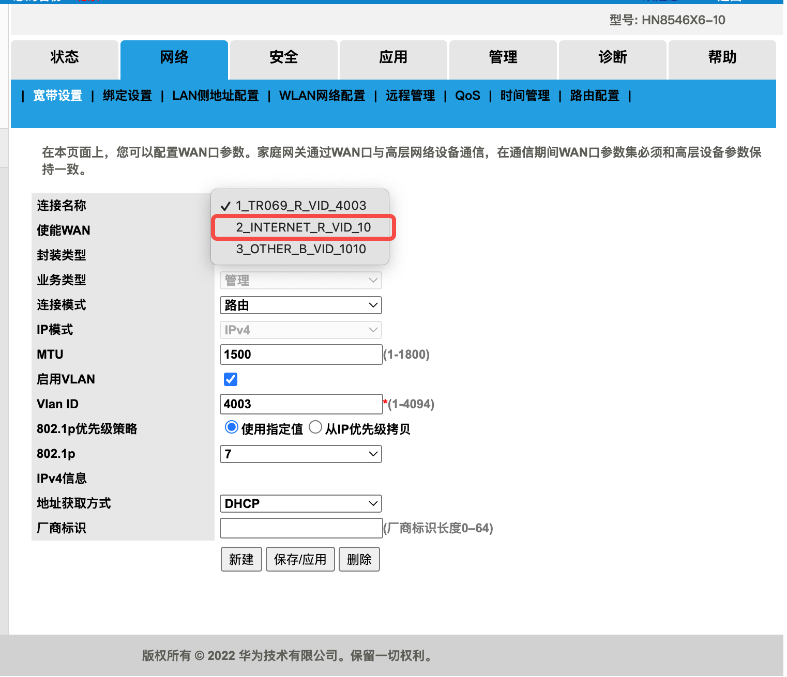

关闭IPV6防火墙，这里没有超管根本关不了，网上有一些奇技淫巧可以关闭，实践后不起作用，还是老老实实用超管账号关吧。

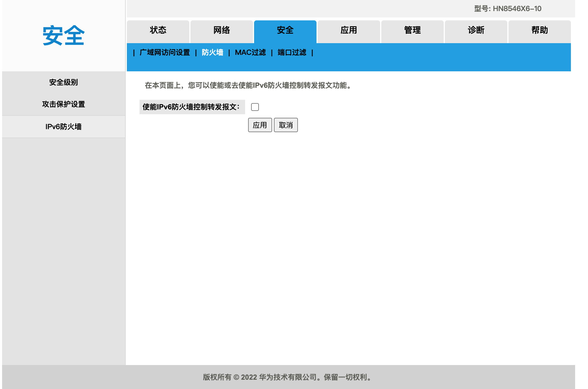

### 3. 路由器设置

我使用的是小米路由器，开启IPV6，并同时关闭防火墙。

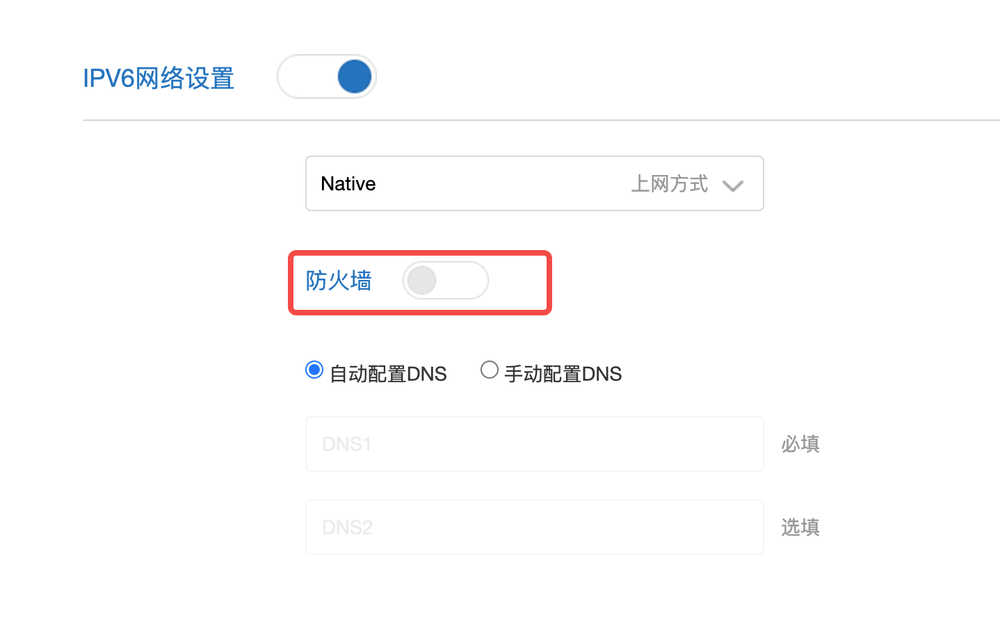

## 测试IPV6

### IPV6 外部网络访问测试

打开 http://www.test-ipv6.com/ ，如果能成功获取公网IPV6地址（2409开头），则代表拥有IPV6访问能力，不过别开心太早，不一定能访问到你自己家的服务器。

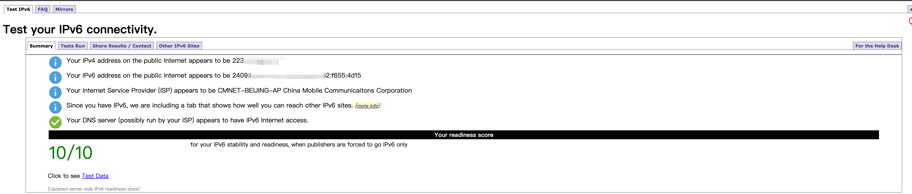

另一种测试方法很简单，通过 ping6 去测试能否ping通

```
ping6 2409:xxxxxxxxxxxxxxxxxxxxxxx
```

但是能ping通也不保险，因为此时你是在本地ping的，有可能本地能ping通ipv6地址，但是外部依旧被防火墙阻挡。

### IPV6 内网访问测试

[IPv6 Ping 测试](https://ipw.cn/ipv6ping/) 这个网址给我们提供了一个远程访问公网IPV6的连通性测试。如果这个网站能测试成功，那么恭喜你，你已经成功打通了IPV6，可以实现内网穿透了。

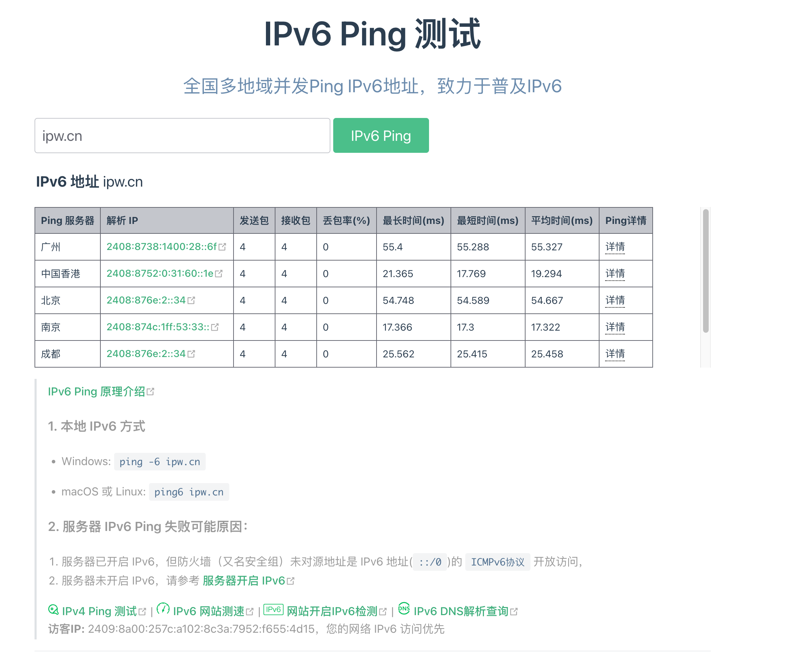

### 辅助资料

由于每个地区的限制不同，如果遇到无法解决的情形，可以参考如下资料：

- [光猫改桥架+路由器拨号实现IPV6](https://blog.jerry.ink/2022/06/24/53/)
  
  [光猫改桥架+路由器拨号实现IPV6-新建连接](https://blog.jixiaob.cn/?post=78)
  
  移动光猫无法设置为桥接，失败。
  
- [光猫开启Telnet，改ip6table解除防火墙限制](https://blog.51cto.com/fengyege/5950834)
  实测下来，第一无法直接使用超管。第二，申请下的超管也是假超管，没有Telnet开启的选项，失败。
  
- [越权访问+删除TR069](https://pve.sqlsec.com/9/5/)
  较为复杂，无法删除TR069

## IPV6 DDNS

上述获取的IPV6不是固定公网IP，是会随时改变的。

通过DDNS，即通过域名的方式，将动态的IPV6绑定到固定域名上就能实现公网IPV6的效果。

下面给出 ddns 的 docker-compose.yaml 文件

```
version: '3'
services:
  ddns:
    image: newfuture/ddns
    container_name: ddns
    restart: always
    volumes:
      - ./config.json:/config.json
    network_mode: host
```

config.yaml 

```
{
  "id": "",
  "token": "cloudflare的token",
  "dns": "cloudflare",
  "ipv4": [],
  "ipv6": ["a.top", "b.world"],
  "index6": "default",
  "ttl": 600,
  "proxy": "DIRECT",
  "debug": true
}
```

由于我的域名服务商是绑定的cloudflare，就给出上述示例。具体的token需要进一步参考 newfuture/ddns 的帮助文件。

最后ping一下试试

```
ping6 a.top
```

## IPV4 客户端-> IPV6服务器端

上面已经提到了，支持IPV6的网络非常少，除了手机流量，大部分网络环境是不支持IPV6解析能力的。那么该如何让IPV4 Only 环境成功访问IPV6服务器呢？

套用CDN是一个非常好的解决方案，即我们通过访问CDN节点，然后由CDN的服务器再访问IPV6的服务器，就可以实现 IPV4 to IPV6 的访问。

> Cloudflare 是一个免费的CDN供应商，通过Cloudflare代理后的网络可以将我们的服务器保护起来，能有效避免DDOS攻击。换句话说，就是给服务器套了一个盾牌。此外，Cloudflare的流量没有限制且免费，在国内的访问速度还可以。

一般认为有如下好处：

1. 免费的DNS解析和CDN代理，DNS支持泛域名解析
2. 支持IPV4 和 IPV6 流量的相互转换
3. 隐藏真实IP地址
4. 避免DDOS攻击
5. 流量无限且免费

教程如下：

[开启 Cloudflare CDN 代理，实现 IPv4 to IPv6 转换](https://blog.csdn.net/qq_38894585/article/details/131054885)

我的DNS设置如下图所示

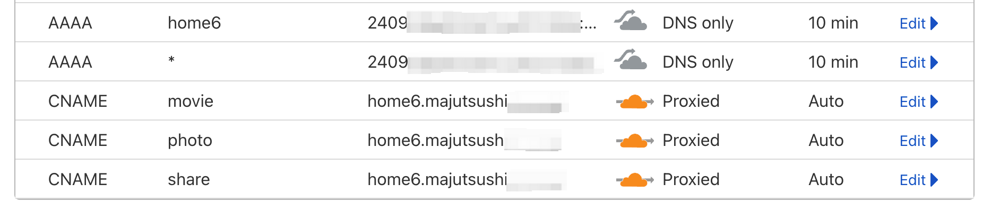

home6 是通过DDNS绑定的域名，CNAME 是域名别名，点亮了小云朵，即实现了IPV4代理。

至于为什么通过CNANME实现，原因是Cloudflare不允许两个AAAA指向的域名，同时支持代理和直连。故我们通过CNAME，让我们的DNS实现这一功能。

### 验证

如果代理成功，那么我们ping IPV4 得到的是IPV4地址，而ping IPV6 得到的是IPV6地址。

```
ping movie.abc.com 
ping6 movie.abc.com
```

### 为什么配置了还是无法代理

#### SSL/TLS 是否设置为FULL

建议给服务器设置证书，使用FULL模式是支持自签证书。为了简化这一步骤，可以使用Caddy 或 NPM 来帮助我们申请。

我使用的NPM，下面是我的npm配置。

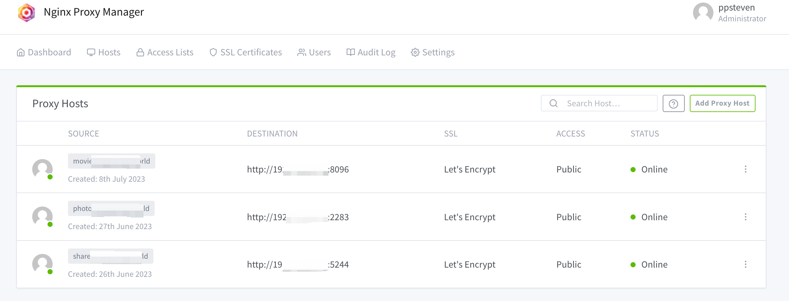

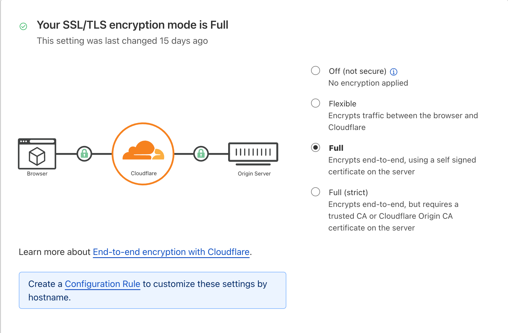

SSL/TSL 连接模式有四种模式： OFF、Flexible SSL、Full SSL、Full SSL (Strict)

- **OFF**：关闭 HTTPS 访问，所有访客重定向到 HTTP。
- **Flexible**：访客访问你网站用 HTTPS，但是 CDN 到你源服务器拉取东西时用的 HTTP 协议。这个SSL模式一键实现用户到CF的SSL加密模式，我们服务器中的网站可以不安装SSL证书，然后用户打开也可以看到是HTTPS格式。根据CF的建议，如果确实没有办法在服务器端给网站安装证书的才使用这个办法。
- **Full**：这个模式区别在于CF到服务器端是可以使用自签证书的。此选项适合源服务器用的是自签名 SSL 证书或无效证书的情况
- **Full (Strict)**：需要CF到服务器端安装SSL证书而且必须是认证过的证书，不可以自签证书。

总结，除了OFF，其他都是使用https与用户连接。建议使用Full (Strict)，如果服务器没有办法上https，就选择Flexible。

> 更多Cloudflare配置详见：[cloudflare加速个人网站和安全防护设置指北](https://www.zhoulujun.cn/html/tools/cloudServices/CDN/8254.html)

#### 端口不能使用80/443

由于运营商的限制，家用光猫是会拒绝80/443端口的入站流量的。所以我们需要改换端口。[Cloudflare支持的端口](https://developers.cloudflare.com/fundamentals/get-started/reference/network-ports/) 如下所示。

HTTP：

- 80
- 8080
- 8880
- 2052
- 2082
- 2086
- 2095

HTTPS:

- 443
- 2053
- 2083
- 2087
- 2096
- 8443

故我们将服务器上的http的监听端口改为8443

### 更改cloudlfare 回溯端口

由于每次我们请求域名都需要带上8443的端口号，实在有点丑，可以通过配置规则，对CDN回溯请求服务器的端口进行更改。

参考教程：[使用cloudflare重写端口](https://blog.csdn.net/weixin_44573077/article/details/129450783)

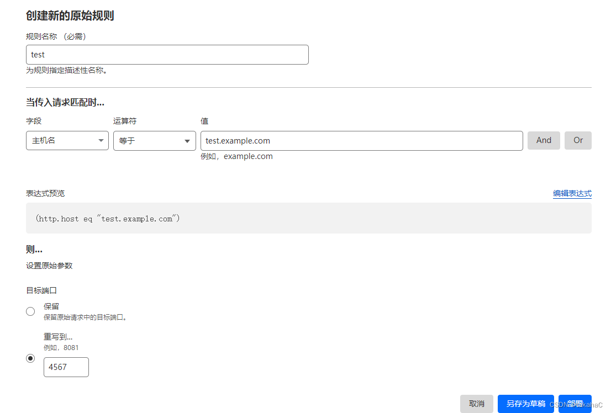

## 总结 & 效果

综上所述，我们通过套用Cloudflare的CDN服务，使我们在IPV4环境下也能访问IPV6上的服务器。

在DNS配置中，域名系统同时支持了IPV6直连和IPV4代理两种模式，这意味着，当我们的网络环境满足IPV6时，还是可以通过直连来最大化的打满我们的带宽，实现最佳的链接速度。

下面放一张我们通过Cloudflare代理后服务器下载资源的速度，由于公司的网络是香港🇭🇰，所以下载速度非常快。

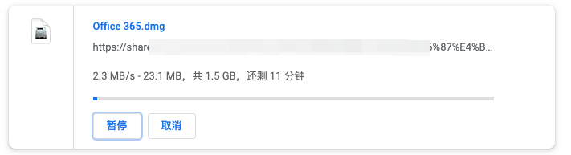

使用手机流量（IPV6）直连的速度。

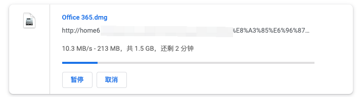