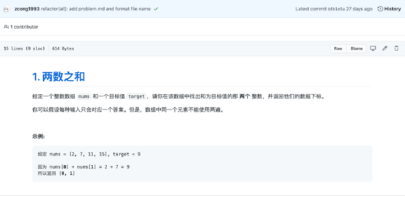
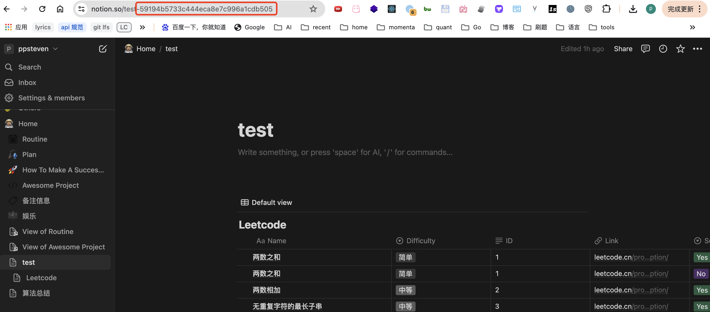

## 前言

最近准备开始刷题，由于过去了很长时间，自己已经忘记了之前刷题的一些注意事项和做题思路。同时Leetcode只提供最简单的刷题记录，查看自己的解题记录也不是那么方便，需要一个个题目去点击查看。为此，我试着在Github上开始寻找是否存在一个Leetcode的刷题工具，能离线记录自己的刷题，并对做过的题目进行分类记录，可以按类型去查看自己刷题进度的一种工具。

最后，找到了 [leetcode-tool](https://github.com/zcong1993/leetcode-tool) 这一个工具，作者还写了一篇 [leetcode-tool 一个让你更方便刷题的工具](https://blog.cong.moe/post/2020-11-30-leetcode_tool) 详细说明了用法，可惜的是，该工具已经多年不维护，于是我基于此工具做了一些定制化的开发以满足我的需求，增加的改动如下：
1. 使用Python脚本爬取Leetcode中英文题目，离线保存。
2. 使用GPT辅助答题
3. 刷题记录导出至Notion看板

项目地址如下：https://github.com/PPsteven/leetcode-tool
编码不易，欢迎点Star多多支持！！

效果如下图所示：


<!-- truncate -->

## Leetcode 刷题的痛点
Leetcode 是一个很好的刷题网站，但是对于做好的题目，在Leetcode上存在如下痛点：
1. 无法方便的查看自己的解题答案
2. 无法对于一题多解和一题多语言的答案进行整理
3. 缺失对已通过题目的分类统计，如查找已完成的 `动态规划`，`链表`的题目，并复习归纳。


## leetcode-tool 功能
为了解决上述问题，其实做法就是在本地保存一份已提交的答案，并对其打标签，最后对标签进行汇总统计生成 `做题清单`。

对此，Leetcode 刷题工具的基础功能如下：
1. 爬取Leetcode题目，并保存在本地。
2. 生成Leetcode刷题模板，模板中包含题目的标签，支持人工修改。
3. 依据标签汇总生产 `做题清单`。
此外，为了方便筛选管理已做的题目，支持导出至Notion看板。

## 安装

```bash
# homebrew
$ brew tap ppsteven/homebrew-tap
$ brew install ppsteven/homebrew-tap/leetcode-tool

$ leetcode-tool help
```


## 使用

### 0. 创建配置文件并下载离线数据包

首先在创建一个做题目录，在目录下创建 `.leetcode.json` 配置文件，可以参考仓库中的 [.leetcode.example.json](https://github.com/PPsteven/leetcode-tool/blob/master/.leetcode.example.json) 文件.

```
{
    "lang": "go/py3/ts/java", // 项目全局语言, 配置后 new 命令 --lang 参数可省略, 目前支持 go ts js py3 java
    "env": "en/cn",
    "gpt": {
    "api_key": "sk-xxx",
        "model": "gpt-3.5-turbo",
        "prompt": "您是一个算法专家，请基于下面的算法题目，给出该算法的思路和复杂度, 使用 {{ .TextLang }} 回答\nSETP1. 给出算法的归类，如递归，栈\nSETP2. 若是存在暴力解法，给出思路和复杂度\nSETP3. 给出最优解法和复杂度\nSETP4. 代码实现，使用 {{ .Lang }} 语言，代码带注释和测试样例。\n\n{{ .Problem }}"
    }
}
```

- lang: 当前支持语言 go/py3/ts/java
- env: 界面语言 cn 中文站/ en 英文站
- gpt: 支持gpt对题目提示，在没有思路的时候辅助解题
  - api_key: openai key
  - model: openai model
  - prompt: 自定义提示词，双花括号代表的是变量，在生成提示词的时候会被替换为字符串
    - {{ .TextLang }} 根据env决定，en:英文，cn:中文
    - {{ .Lang }} 编程语言
    - {{ .Problem }} 题目内容，必须加上
    - prompt 如果不填写的话，就使用如下默认prompt提示词模板

```
您是一个算法专家，请基于下面的算法题目，给出该算法的思路和复杂度, 使用 {{ .TextLang }} 回答
SETP1. 给出算法的归类，如递归，栈
SETP2. 若是存在暴力解法，给出思路和复杂度
SETP3. 给出最优解法和复杂度
SETP4. 代码实现，使用 {{ .Lang }} 语言，代码带注释和测试样例。

{{ .Problem }}
```

尝试获取题目信息，第一次使用时，会尝试从Github下载Leetcode离线数据包，其中包含了所有题目信息。

（P.S. 这个数据是通过Python脚本爬虫实现，具体详见代码：[leetcode_crawler.py](https://github.com/PPsteven/leetcode-tool/blob/master/script/leetcode_crawler.py)）

```bash
$ leetcode-tool meta 1
file problems.json not exists, start downloading from https://raw.githubusercontent.com/PPsteven/leetcode-tool/master/problems.json
&{Index:1 Title:两数之和 Slug:two-sum Difficulty:简单 Tags:[array hash-table] Link:https://leetcode.cn/problems/two-sum/description/ Content: Code: Solved:false}
```

但是国内的用户可能由于网络原因无法下载，此时需要手动下载存放在吧本地目录中。

```bash
$ wget https://raw.githubusercontent.com/PPsteven/leetcode-tool/master/problems.json
```

### 1. 创建题目
刷题之前先得有题目ID, 要去 LeetCode 上面找一道题目, 找到它的序号(必须是前端页面看到的). 然后运行:

```bash
❯ leetcode-tool new --lang go 1
```

此步骤会创建一个题解文件夹和三个文件:

```bash
❯ tree solve/solve0001
solve/solve0001
├── problem.md # 题目描述文件
├── solve_0001.go # 题解源码文件
└── solve_0001_test.go # 测试文件
```

`problem.md` 文件为 LeetCode 网页上的题目描述, 在 GitHub 上面显示完全正常, 代码块和图片都可正常显示;



`solve_0001.go` 为初始化的源码文件:

```go
package solve0001

/**
 * @index 1
 * @title 两数之和
 * @difficulty 简单
 * @tags array,hash-table
 * @draft false
 * @link https://leetcode-cn.com/problems/two-sum/
 * @frontendId 1
 */

func twoSum(nums []int, target int) []int {

}
```

文件中间的注解是后面生成汇总文件表格所需要的信息, 都是通过 api 获取到的题目信息.

`solve_0001_test.go` 相对很简陋:

```go
package solve0001_test
```

以上, 题目初始化就完成了.

_注意:_ 刷题基本是只会选择一门语言, 所以 `--lang` 这个参数略显繁琐, 我们可以在项目根文件创建一个内容为 `{ "lang": "go" }` 的 `.leetcode.json` 文件, 此参数就可以省略了。

### 2. 解题
~~工具再好也不可能帮你解题, 所以解题还是要靠自己.~~

目前，基于LLM大模型技术，已经可以实现使用GPT辅助刷题了：[GPT-4满分第一名通过大厂模拟面试！微软154页研究刷屏：与AGI的第一次接触](https://wallstreetcn.com/articles/3684883)

首先，配置好字段 `gpt.api_key`，`gpt.model`，`gpt.prompt`（可选）

```diff
{
    "lang": "go/py3/ts/java", // 项目全局语言, 配置后 new 命令 --lang 参数可省略, 目前支持 go ts js py3 java
    "env": "en/cn",
+    "gpt": {
+    "api_key": "sk-xxx",
+        "model": "gpt-3.5-turbo",
+        "prompt": "您是一个算法专家，请基于下面的算法题目，给出该算法的思路和复杂度, 使用 {{ .TextLang }} 回答\nSETP1. 给出算法的归类，如递归，栈\nSETP2. 若是存在暴力解法，给出思路和复杂度\nSETP3. 给出最优解法和复杂度\nSETP4. 代码实现，使用 {{ .Lang }} 语言，代码带注释和测试样例。\n\n{{ .Problem }}"
    }
}
```

开始解题

```bash
$ leetcode-tool gpt 4
```

效果如下：


入门题目直接搞定, 并且完成测试文件:

```go
// solve_0001.go
func twoSum(nums []int, target int) []int {
	mp := make(map[int]int, 0)
	for i, num := range nums {
		if idx, ok := mp[target-num]; ok {
			return []int{idx, i}
		}
		mp[num] = i
	}
	return []int{}
}
```

```go
// solve_0001_test.go
func TestTwoSum(t *testing.T) {
	assert.Equal(t, []int{0, 1}, twoSum([]int{2, 7, 11, 15}, 9))
	assert.Equal(t, []int{}, twoSum([]int{2, 7, 11, 15}, 4))
}
```

搞定题目.

### 3. 更新题目分类汇总

下面是自动生成的题目注释，通过编辑注释信息，帮助我们分类该题的解法。

```
/**
 * @index 1
 * @title Two Sum
 * @difficulty EASY
 * @tags array,hash-table
 * @draft false
 * @link https://leetcode.cn/problems/two-sum/description/
 * @frontendId 1
 * @solved false
*/
```

- index: 题目编号
- title: 题目名称
- difficulty: 题目难易程度
- tags: 题目标签默认为Leetcode标签，同时也可以自定义标签
- draft: 是否草稿，true 则不会在update的时候对该题进行分类
- link: 题目链接
- frontendId: 题目编号
- solved: 是否解决

开始更新

```bash
❯ leetcode-tool update
```

更新完成后，就会成功生成如下分类


### 4. 同步至github

```bash
> git add . 
> git commit -m "update"
```

最终的效果可以参考：

- [zcong1993/algo-go](https://github.com/zcong1993/algo-go)
- [PPsteven/algorithm](https://github.com/PPsteven/algorithm)

### 5. 同步至Notion数据库

配置好字段 `notion.token`，`notion.database_id`，`notion.page_id`（选填）

1. 首先，申请 notion 权限，支持通过 `notion-api` 操作你得notion页面，教程随便找了一个：[取得Notion API Key 流程](https://seedao.notion.site/Notion-API-Key-32a2aa92e8f346f4813dfbab80e7c6dd?pvs=21)

2. 获取 page_id
   点开你的notion页面，进入你需要创建的数据库的父页面，直接获取 URL 地址中 `-` 后的一串字符串。

   

   并填入 `.leetcode.json` 中

```diff
{
+  "notion": {
+    "token": "secret_nDoJWULxdaudMhbEdSo1g2TWUqYxqnArow4w6qo2NX",
+    "database_id": "3fbv1c2bf55e4fa18c66a5b0a61fa403",
+    "page_id": "59194b57331444eca8e7c996a1cdb505"
  }
}
```

3. 同步并创建数据库
   使用如下命令，开启同步记录至notion页面

```bash
$ leetcode-tool sync --notion
2024/05/05 00:56:43 Create Database: e7086c88f6504623956d1271b70aa2b4, Please add the database_id in the config file
2024/05/05 00:56:43 Visited Link: https://www.notion.so/e7086c88f6504623956d1271b70aa2b4
sync leetcode record to notion, progress: 51/52%
```

除此使用，会在当前notion页面下创建一个 `inline` 显示的数据库，终端会给出其数据库的id，如 `e7086c88f6504623956d1271b70aa2b4`


4. 更新数据库

将上面获取的 database_id 手动添加至 `.leetcode.json` 文件中后，未来的每次更新都会更新该数据库，当且仅当数据发生变动后才会更新

```bash
$ leetcode-tool sync --notion
```

## 后记

本项目在开发过程中，如下开源项目给予了灵感和代码参考

>  https://github.com/zcong1993/leetcode-tool

此项目已多年不更新，本代码在Fork此仓库的基础上添加了如下功能：

- 离线下载了 Leetcode 3400+题，保证了在Leetcode接口发生改变后依然可以运行。
- 优化了部分代码逻辑
- 接入了Openai辅助解题

Leetcode 题目爬虫使用Python实现，详见 `scripts` 文件夹，代码参考：https://github.com/bunnyxt/lcid

notion 接入部分，参考了：

- [leetcode_to_notion](https://github.com/xzhao11/leetcode_to_notion)
- [notion/developers](https://developers.notion.com/reference/intro)