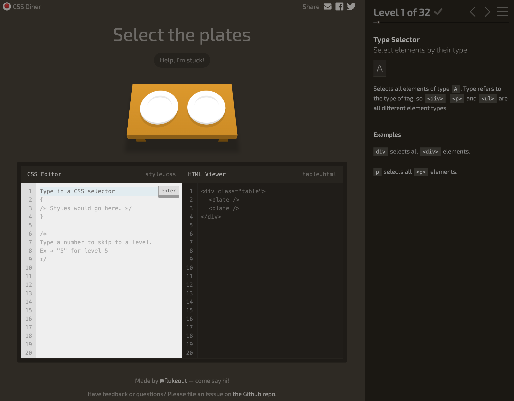
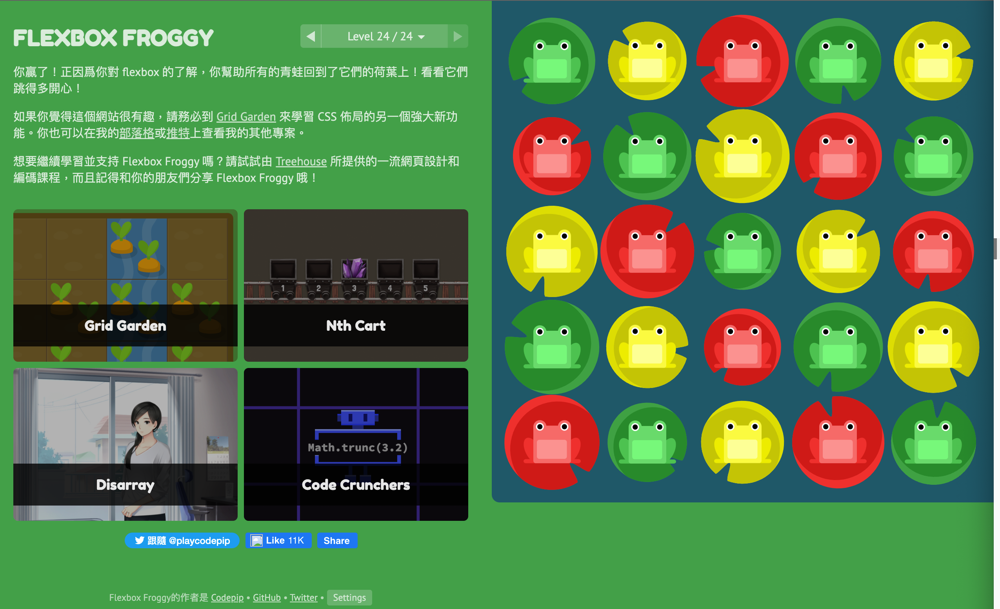
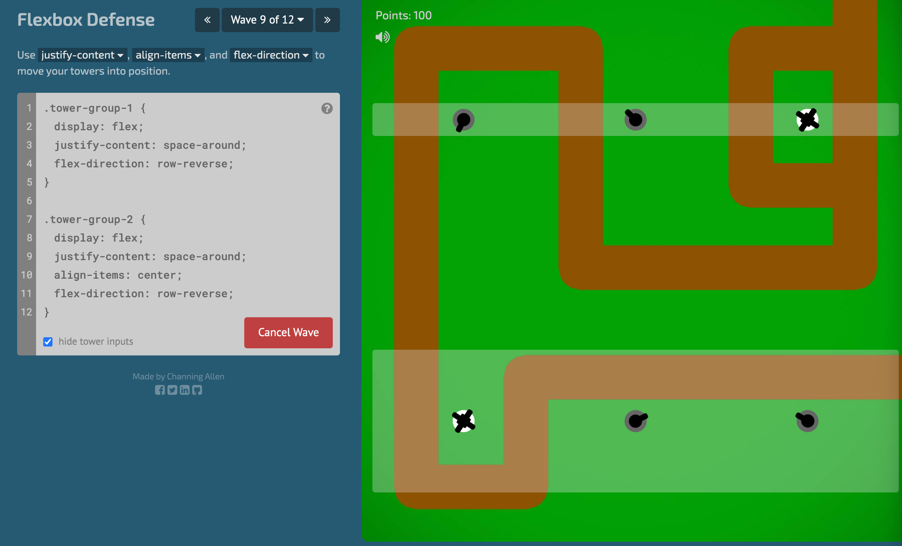
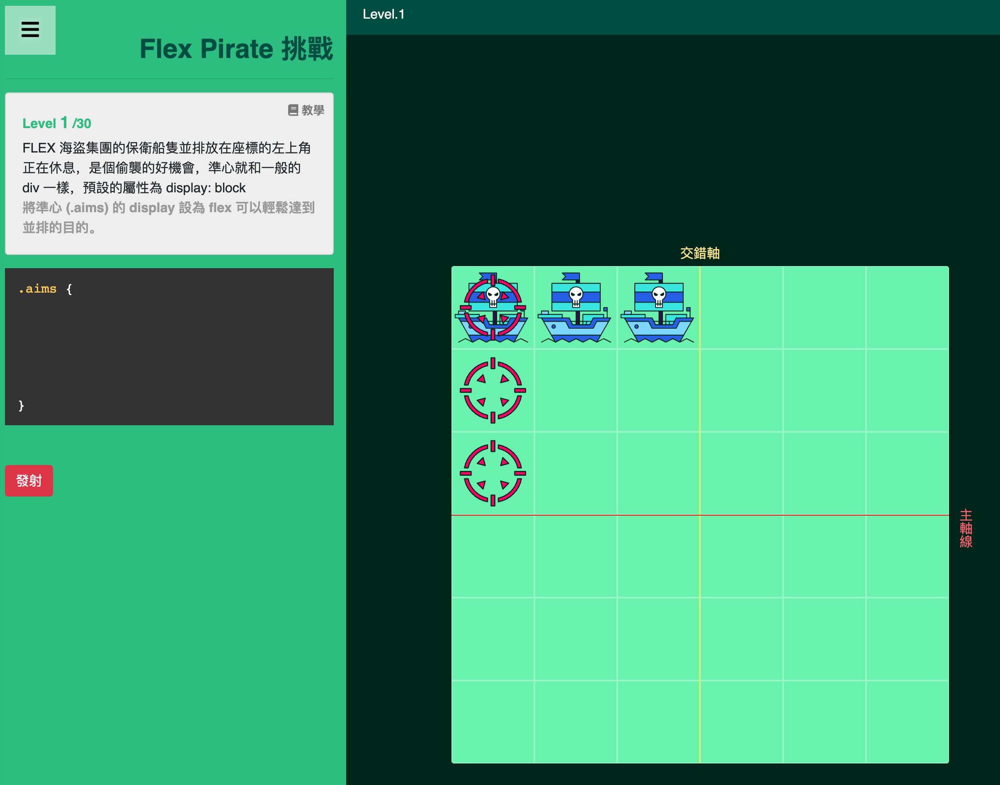

帮助掌握CSS的小游戏，建议先学习完【CSS基础知识】后再练习

## CSS Diner

官网：https://flukeout.github.io/

基础`CSS选择器`游戏，总共32个关卡，熟练的5分钟刷完。

## FlEXBOX FROGGY

官网：http://flexboxfroggy.com

Flex布局学习，总共24个关卡，最后一关需要好好想想。作者还贴心的给了鼠标操作，几乎不用键盘就可以玩耍。

看完 [深入解析 CSS Flexbox](https://www.oxxostudio.tw/articles/201501/css-flexbox.html) 后，可以作为练习。

## Flexbox Defense

官网：http://www.flexboxdefense.com/

同上面的一致，CSS塔防游戏，趣味性更强，更灵活，但是对于CSS基础不太扎实的话，还是建议先玩上面的FlEXBOX FROGGY，更成体系。

## Flex Pirate 擊倒海盜 (六角學院)

官网：https://w3c.hexschool.com/flexbox/cc1c1b71

在所有的挑战中，这种是教程和游戏都设计很精巧的，而且还加入了flex-shrink等放缩功能，非常推荐小白和高手。

## Knights of the Flexbox Table

官网：[https://knightsoftheflexboxtable.com/](https://knightsoftheflexboxtable.com/?spm=a2c6h.12873639.article-detail.10.1bcf7086Wc84A2)

如果做过上述的Flex布局的CSS练习后，本游戏非常简单，有助于理解Tailwind是如何实现传统CSS功能的。