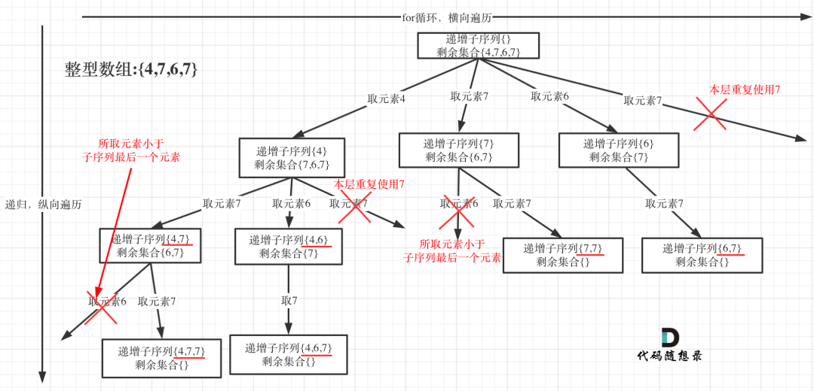

## 题目描述

找出给定整数数组的递增子序列，子序列的长度至少是2

## 样例

```
Input: [4, 6, 7, 7]
Output: [[4, 6], [4, 7], [4, 6, 7], [4, 6, 7, 7], [6, 7], [6, 7, 7], [7,7], [4,7,7]]
# 官方题解有点陷阱, 数组可能是无序的
Input: [4, 6, 4, 7]
Ouput: [[4,6],[4,6,7],[4,4],[4,4,7],[4,7],[6,7]]
```

## 题目解析

强烈建议查看 [回溯算法：递增子序列](https://mp.weixin.qq.com/s?__biz=MzUxNjY5NTYxNA==&mid=2247485466&idx=1&sn=2b5420bca9b66356d777bc4530a224c5&scene=21#wechat_redirect) 思路很清晰，单层使用 集合 做去重，很巧妙，也比一般的解答好理解很多。

本题很容易和 [子集2](/pages/a7c436/) 混在一起，他们的主要区别是数组可能是无序的，这使得 [子集2](/pages/a7c436/) 中的去重策略失效了。



## Python 示例

```python
def backtracking(nums, ans, cur, tmp):
    if len(tmp) >= 2:
        ans.append(tmp[:])
    
    visited = set()
    for i in range(cur, len(nums)):
        if (tmp and nums[i] < tmp[-1]) or nums[i] in visited : # 1.不满足递增 2. 同层已访问过
            continue
        visited.add(nums[i]) 
        tmp.append(nums[i])
        backtracking(nums, ans, i + 1, tmp)
        tmp.pop()

class Solution:
    def findSubsequences(self, nums: List[int]) -> List[List[int]]:
        ans = []
        backtracking(nums, ans, 0, [])
        return ans 
```

